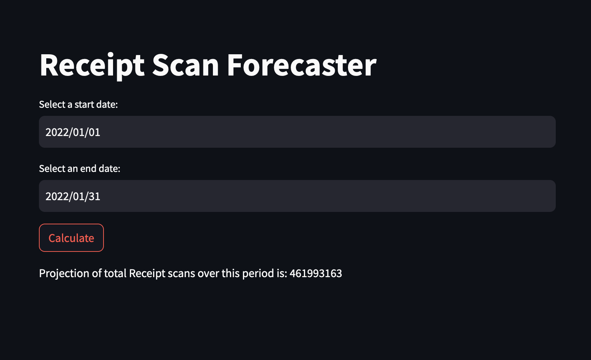

# Receipt Scan Forecaster

This is my approach to the "Fetch Rewards Take-home Exercise - Machine Learning Engineer," and it is public only for the purpose of sharing it with the evaluator.

## Problem Statement

The problem statement can be found [here](https://fetch-hiring.s3.amazonaws.com/machine-learning-engineer/receipt-count-prediction/Receipt_Count_Prediction.html).

## Contents of the Repository

### Training Section

- [model_training.ipynb](model_training.ipynb): Contains the code for training and visualization.
- [data_daily.csv](data_daily.csv): Contains the training data.

### Receipt Scan Forecaster Application

- [fastapi_app.py](fastapi_app.py): Hosts the trained PyTorch model and provides an API endpoint for function calls to the model.
- [streamlit_app.py](streamlit_app.py): This contains the code for the frontend app that takes in the time range and outputs the total projected receipt scans during that period.
- [Dockerfile](Dockerfile): Contains the Docker environment details.
- [linear_regression_model.pt](linear_regression_model.pt): Contains the saved model.

## Running Instructions

### To Train the Model

- Open [model_training.ipynb](model_training.ipynb) and run all blocks.

### To Test the Model in a Docker Container

1. Build the container:

   ```bash
   cd {PATH_TO_THE_REPOSITORY}
   docker build -t receipt_scan_forecaster .
   ```

2. Run the container:

   ```bash
   docker run -p 8501:8501 -p 8080:8080 receipt_scan_forecaster
   ```

3. Access the frontend by opening <http://localhost:8501/>.

## Application Preview


  